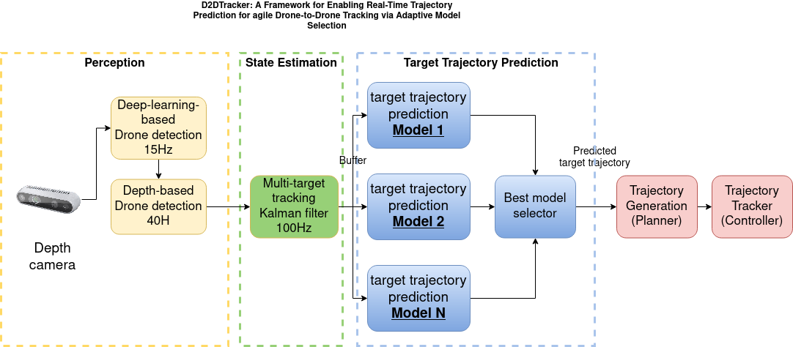

# d2dtracker_drone_detector

This repository provides an implementation of the SMART-TRACK framework, which is currently under review in IEEE Sensors. The SMART-TRACK framework is designed to enhance UAV object tracking by using a novel measurement augmentation system that leverages Kalman Filter (KF) predictions to guide the detection and localization process. This approach is particularly effective in scenarios where primary object detectors might fail intermittently, ensuring more robust state estimation and continuity in tracking. The framework is implemented as a ROS 2 package with nodes that perform drone detection using neural networks and depth maps.

**NOTE** Use the `ros2__humble` branch if you use use ROS 2 humble (the currentloy supported version)

<!-- 

**NOTE**

**This repository is part of the D2DTracker work which is submitted to the IROS 2023 conference. The code will be availble once the paper is accepted.** -->

# Installation
* We detect drones using YOLOv8. Make sure to install YOLOv8 before you continue.
* Clone [yolov8_ros](https://github.com/mgonzs13/yolov8_ros/releases/tag/2.0.1), and use release `2.0.1` which we tested with YOLOv8 with commit `b638c4ed`
* we provide a Yolov8 custom model for drone detection available in the [config](https://github.com/mzahana/d2dtracker_drone_detector/tree/main/config) directory of this package. The name of the model is `drone_detection_v3.pt`. You can use this model with `yolov8_ros` package.
* Check the remaining dependencies in the package.xml file.
* The `main` branch of this repository contains the ROS 2 `humble` version of this package.
* Clone our Kalman filter implementation [multi_target_kf](https://github.com/mzahana/multi_target_kf/tree/ros2_humble) in your `ros2_ws/src`. Checkout the `ros2_humble` branch.
<!-- * This package is installed as part of the `d2dtracker` development environment, see installation instructions in the [d2dtracker_sim](https://github.com/mzahana/d2dtracker_sim) package. -->
* Build your ros2 workspace using `colcon build`


# Run
* Make sure this package is inside the ROS 2 workspace
* Make sure that you build the ROS 2 workspace, and source `install/setup.bash`
* Run the 

* To run the pose estimator, run the following launch file,
    ```bash
    ros2 launch d2dtracker_drone_detector yolo2pose.launch
    ```
* The [yolo2pose_node.py](https://github.com/mzahana/d2dtracker_drone_detector/blob/main/d2dtracker_drone_detector/yolo2pose_node.py) also accepts Kalman filter estimation of the target 3D position in order to implement the KF-guided measurement algorithm for more robust state estimation. We use our Kalman filter implementation in [multi_target_kf](https://github.com/mzahana/multi_target_kf/tree/ros2_humble)
# `yolo2pose_node.py`
## Subscribed topics
TBD
## Published topics
TBD

# NOTES
* Make sure that you provide the correct depth image topic in [here](https://github.com/mzahana/d2dtracker_drone_detector/blob/366cf6440327db84f493fca2337a3b551edffeb2/launch/detection.launch.py#L28), and the camera info topic [here](https://github.com/mzahana/d2dtracker_drone_detector/blob/366cf6440327db84f493fca2337a3b551edffeb2/launch/detection.launch.py#L33)
* There should be a valid static transformation between the robot base link frame and the camera frame. For an example, see [here](https://github.com/mzahana/d2dtracker_sim/blob/5ea454e95fd292ab16cb3d28c50bb2182572ad52/launch/interceptor.launch.py#L94). This is required to compute the position of the detected drone in the observer's localization frame, which can be sent to a Kalman filter in a later stage.
* You can configure the depth-based detection parameters in [here](https://github.com/mzahana/d2dtracker_drone_detector/blob/366cf6440327db84f493fca2337a3b551edffeb2/config/detection_param.yaml)
* Make sure that you build your workspace after any modifications, using `colcon build`